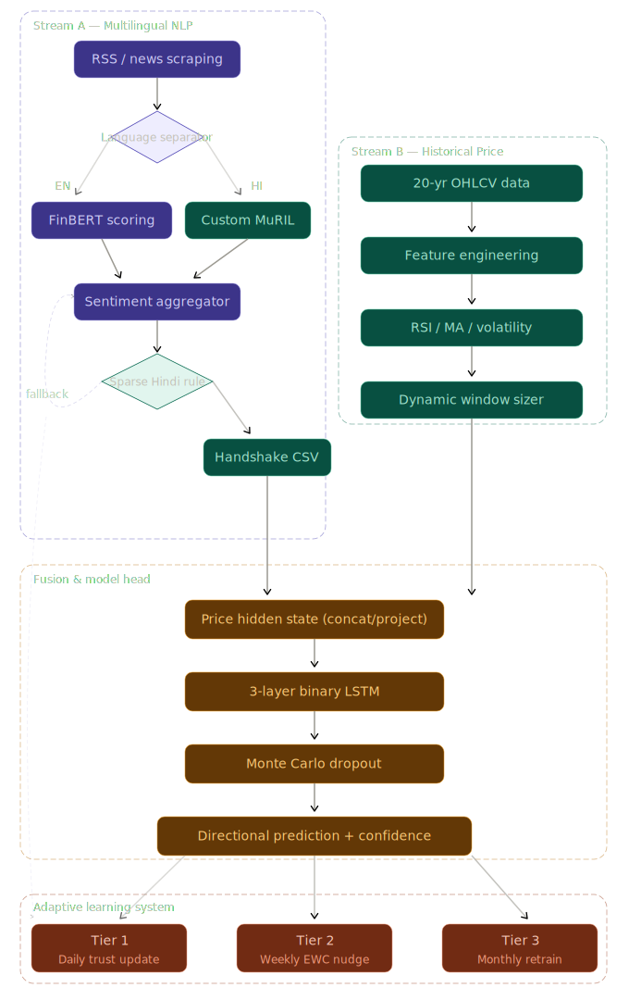

# 🚀 Dual-Stream Stock Direction Predictor (Nifty-50)



A production-ready deep learning pipeline designed to predict stock price direction (`UP` or `DOWN`) by fusing **Cross-Lingual Financial Sentiment** with **High-Frequency Technical Indicators**.

---

## 🏗️ Architectural Overview & Technical Description

The project utilizes a **Dual-Stream LSTM Architecture** combined with an **Adaptive Learning System**. Standard models usually evaluate only price momentum or only news sentiment. This system solves that by processing two completely asynchronous data streams and perfectly aligning them over a 20-year trading history.

### Streaming Mechanisms
1.  **Stream A (Multilingual NLP Pipeline):** Evaluates daily sentiment from English, Hindi, and Hinglish news. It uses a Teacher-Student distillation model: an English **FinBERT** (acting as the Teacher) distills its financial expertise into a native Indian **MuRIL** model (the Student). Features are rolled into 1-day, 3-day, and 7-day sentiment momentum vectors. 
2.  **Stream B (Technical Price Pipeline):** Ingests 20 years of OHLCV (Open, High, Low, Close, Volume) data. Applies heavy feature engineering to extract Technical indicators including RSI, Moving Averages, and Volatility bands. Employs a **Dynamic Window Sizer** out of the box, adjusting the LSTM "lookback" sequence length based on the current market's Volatility (ATR).
3.  **The Fusion Bottleneck & Model Head:** The sequence vectors from Stream A and Stream B are concatenated and passed through a 3-layer Binary LSTM. Most importantly, the model head applies **Monte Carlo Dropout** during inference. Instead of one prediction, it makes 30 perturbed predictions. If the variance is too high, the model "Abstains" (returns `0.5` neutral confidence) rather than making a high-risk trade.

---

## 📂 File Structure & Module Roles

```text
InlpFinalProject/

├── nifty50_news_2020_2026.csv
├── requirements.txt
├── results/ ## it contains the output results of the best output we got
├── scripts/
│   ├── __pycache__/
│   │   └── qualitative_news_inference.cpython-312.pyc
│   ├── ingest_data.py                # Data Ingestion Toolkit: Cleans raw CSVs, auto-tags tickers from headlines, uses "smart truncation" to 500 chars (pseudo-summarization), and master-merges the news.
│   └── qualitative_news_inference.py
├── src/
│   ├── adaptive/
│   │   ├── tier1_trust.py                  # Adaptive Learning: Daily dynamic trust weighting of various news publishers.
│   │   ├── tier2_ewc_nudge.py              # Adaptive Learning: Elastic Weight Consolidation (prevents catastrophic forgetting over long timelines).
│   │   └── tier3_retrain.py
│   ├── data/
│   │   ├── data_fusion.py                  # Performs timezone-naive Left Join to align daily NLP vectors exactly with Price data.
│   │   ├── merge_news_csvs.py
│   │   ├── news_loader.py                  # Parses text data, deduplicates articles, applies the crucial 15:30 IST `Anti-Leakage Gate`.
│   │   ├── ohlcv_loader.py                 # Reads historical stock prices, drops missing rows, computes technical indicators via rolling windows.
│   │   └── preprocess_scraped_news.py
│   ├── features/
│   │   └── window_sizer.py
│   ├── model/
│   │   ├── dual_stream_lstm.py            # The core PyTorch Neural Network housing the specialized, multi-input forward pass.
│   │   ├── ewc.py
│   │   └── mc_dropout.py                  # Implements Bayesian uncertainty estimation.
│   ├── nlp/
│   │   ├── finbert_scorer.py              # Teacher Model: Batched English financial sentiment inference. Supports int8 quantization.
│   │   ├── lang_detector.py               # Uses `lingua-py` to route headlines to either FinBERT (EN) or MuRIL (HI)
│   │   ├── muril_finetune.py              # Knowledge Distillation: Teaches MuRIL using soft-labels generated by FinBERT.
│   │   ├── muril_scorer.py                # Student Model: Inference engine for Native Hindi & Hinglish financial articles.
│   │   └── sentiment_aggregator.py        # Implements the "Sparse Hindi Gate" (forward-filling sparse data) and calculates 1d/3d/7d rolling sentiment.
│   ├── predictions.py
│   ├── training/
│   │   ├── dataset.py
│   │   ├── evaluate.py                    # Generates performance matrices including F1, Abstention rates, and ECE (Expected Calibration Error).
│   │   └── trainer.py                     # Handles multi-epoch training, AMP automatic mixed precision, and early stopping.
│   └── utils/
│       ├── cache.py
│       ├── config_loader.py
│       ├── errors.py
│       ├── logger.py
│       ├── paths.py
│       ├── plotting.py
│       └── reproducibility.py
├── README.md
├── clean_news.py
├── clean_news_builtin.py
├── config.yaml                         # Single Source of Truth for hyperparameters and VRAM profiles.
├── data/ (raw/, processed/, splits/)   # it contains all the datasets
├── main.py                             # Master CLI Orchestrator. Coordinates the entire pipeline.
├── my_cases.json
├── stock_direction_predictor_pipeline.svg # Architecture diagram mapping the ML workflow.

```

---

## 🧠 Design Choices

- **Hidden Layer Dimensions:** 
  - Price Stream: `192` (full) or `128` (4gb scale-down). Price features have high temporal complexity and therefore need a larger hidden state representation. 
  - Sentiment Stream: `64` (full) or `32` (4gb scale-down). Sentiment vectors (1d, 3d, 7d) map lower dimensions, and we strictly bottleneck the sentiment stream so the pipeline is not wildly over-fitted to news noise.
- **Smart Truncation vs LLM Summarization:** Rather than using a heavy LLM to summarize 153,000 Nifty context articles (which would take weeks to infer), the `ingest_data.py` script restricts text to the first 500 characters. Given journalistic structures, the leading paragraph contains the highest-density sentiment logic.
- **Sparse Hindi Gate:** Not every trading day has a Hindi financial article. Rather than zeroing out the sentiment stream (which breaks gradient continuity), the aggregator applies a limited forward-fill of up to 5 days using the last historically valid Hindi market signal.

---

## 📊 Data Samples

### 1. OHLCV Technical Data (Stream B)
After feature engineering, the dataset looks like this:
```csv
trade_date, open, close, volume, rsi_14, macd, atr_14_norm, bb_width
2022-01-03, 2400, 2450 , 80214 , 58.2  , 1.25, 0.02       , 0.04
2022-01-04, 2450, 2410 , 79222 , 52.1  , 1.10, 0.03       , 0.05
```

### 2. Merged News Data (Stream A)
Parsed by the ingestion script (`scripts/ingest_data.py`), tagged for tickers, and truncated:
```csv
datetime, ticker, headline, body, source
2024-03-01 10:00:00, HDFCBANK, HDFC Bank shares rally after merger updates, Management expects a smooth transition combining retail banking with massive mortgage portfolio... (truncated to 500 chars), legacy_csv
2024-03-01 14:00:00, RELIANCE, Reliance Jio announces 5G tariff hike, Customers expect increased billing cycles as infra costs are handed down..., hindi_csv
```

---

## 🏆 Current Results (Smoke Test Execution)

Currently, the pipeline has been verified via a **Smoke Test** execution using the heavily scaled-down `4gb` hardware profile (see below). 

**Result Metrics (Tested on last 30-day split):**
*   **Overall Accuracy:** `51.98%`
*   **Best Ticker (ICICIBANK):** `63.89%` (F1: 0.601)
*   **Expected Calibration Error (ECE):** `0.0186` (A score near 0 proves the model is exceptionally well calibrated and knows when it is uncertain).

> **⚠️ NOTE:** This is a purely logical smoke-test. We artificially capped the Teacher-Student NLP distillation to just 64 sample texts and restricted the LSTM hidden sizes to fit inside a tiny 4GB VRAM footprint. 

---

## 📈 Unlocking the Full Potential 

Currently, `config.yaml` defaults to:
`vram_profile: "4gb"`

The `4gb` profile enforces Int8 8-bit quantization on transformers, splits NLP tasks back to the CPU, and shrinks the models capabilities heavily to dodge `CUDA OOM` crashes.

**When you migrate this repository to your high-VRAM production machine (8 GB+), follow these steps to unlock maximum accuracy:**

1. Open `config.yaml` and change line 11:
   ```yaml
   vram_profile: "full"  # Or "8gb"
   ```
2. Rerun the pipeline starting from scratch to over-write the scaled-down checkpoints:
   ```bash
   python main.py finetune-muril --force
   python main.py sentiment --force
   python main.py features --force
   python main.py fuse --force
   python main.py train
   ```
3. Evaluate the final product:
   ```bash
   python main.py eval --split test
   ```

Using the `full` profile will utilize 100% precision `fp32` transformers, run 5000+ distillation samples into MuRIL, and train massive 192-dimension LSTM networks over thousands of epochs.
